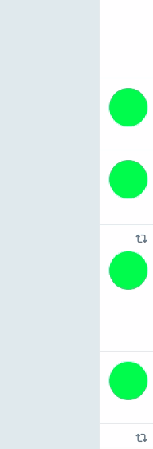

# Twitter Icon Single-Coloar-Ball Converter
* For eliminating egos.

## Demo

## How to install
* Clone this repository

  `git clone https://github.com/izuna385/twitter_Icon_singleColoarBall`

* Open chrome extension

  `chrome://extensions/`

* Read the cloned repository directory.

  

## Todo
* One icon, one random color.
